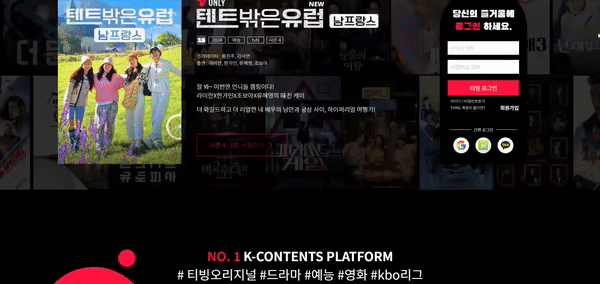
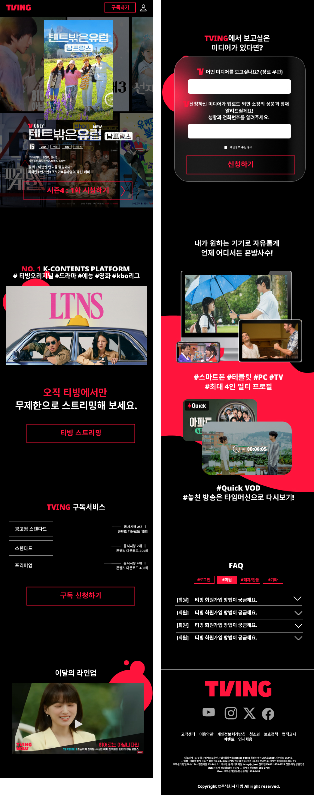
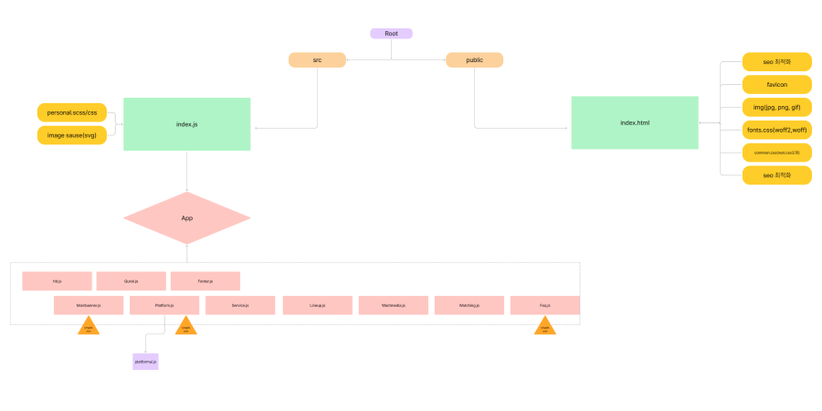

     
     

 
<h2>💎목차</h2>

1. [티빙 소개](#no-1-k-content-platform-tving) 
2. [seo최적화](#오직-티빙tving에서만) 
3. [타겟/퍼소나](#타겟--퍼소나) 
4. [작업](#작업) 
5. [데스크탑/모바일 디자인](#데스크탑모바일-디자인) 
6. [컴포넌트 다이어그램](#컴포넌트-다이어그램) 
7. [언어/개발활경도구(IDE)](#언어--개발활경도구ide) 
8. [플러그인](#플러그인) 
9. [About project](#about-project-contact)
10. [About contact](#about-contact) 

# NO. 1 K-CONTENT PLATFORM, "TVING"
수많은 OTT중 꾸준한 상승세를 보여주는 티빙.  
"미디어 시청"이란 단순한 목적 속에서 원하는 작품을 하나의 OTT에서,  
빠른접속과 추천작품을 보고싶은 퍼소나를 선정하여 기획 및 제작하였습니다.

# 오직, 티빙(TVING)에서만
<h3>💎seo최적화  </h3>
"티빙 프로젝트 | 정주은 포트폴리오"

<h3>💎검색 키워드 </h3>
티빙, 리액트, ott, 미디어, 티빙오리지널, 콘텐츠, 생중계, 드라마, 영화, 예능, 애니메이션

# 타겟 / 퍼소나

<h3>😶타겟</h3> 
티빙 연령층 조사 결과  
1위 30대(28%)  
2위 20대(26%)  
3위40대(25%)  
4위 50대(15%)  
5위 10대(6%)  
👉 문화생활 및 트렌드에 예민하고 빠르게 접할 수 있는 20-30대 중점 

<h3>😶퍼소나</h3> 

A : 원하는 미디어를 하나의 OTT에서 보기를 희망하는 20-30대 
B : 미디어를 볼 의향이 있지만 무엇을 볼지 선택하기 어려운 이용자 
👉공통적으로 빠르게 접속이 가능하고 시각적 흥미를 이끌어낼 수 있는 OTT를 소비하고자 함.

# 작업
💎작업기간 : 약 4주 소요  
💎기획(2일) 👉디자인(2-3일)👉컴포넌트 구성(1일)👉개발(1주)👉반응형 및 수정(2주)  

☝ 
대표색을 사용하여 밋밋할 수 있는 검은 배경에 이미지를 넣어 생동감을 주었고,  
로그인폼을 메인배너에 나타나도록 구현하고, 원하는 미디어를 신청하고  
소정의 상품을 주는 이벤트로 사용자들의 참여도를 높이고자 하였습니다.  
✌ 
메인배너(+로그인)-플랫폼 소개 - 구독서비스 - 이달의 라인업 - 미디어신청 - 시청가능기기 - FAQ  
로 배열하여
중간 이탈율을 줄이고자 정보성 콘텐츠 사이에  사용자들이 관심을 가지고 참여할 수 있는 콘텐츠를 삽입하였습니다.

# 데스크탑/모바일 디자인
<h3>💎데스크탑</h3>
 
<h3>💎모바일</h3>

# 컴포넌트 다이어그램

# 언어 / 개발활경도구(IDE)
언어 : 
    
	
    
    
    
      
     

IDE :  

 

# 플러그인

|||
|:---|:---|
|@testing-library/jest-dom: ^5.17.0|@testing-library/react: ^13.4.0|
|@testing-library/user-event: ^13.5.0|aos: ^2.3.4|
|aos: ^2.3.4|axios: ^1.7.2|
|bootstrap: ^5.3.3|bootstrap-icons: ^1.11.3|
|react: ^18.3.1|react-bootstrap: ^2.10.4|
|react-dom: ^18.3.1|react-router-dom": ^6.25.1|
|react-scripts: 5.0.1|sass: ^1.77.8|
|styled-components: ^6.1.12|swiper: ^11.1.5|

# About Project Contact
👉 [TVING](https://tving-zueunjoengs-projects.vercel.app/) 
👉[Git Hub](https://github.com/zueunjoeng/TVING) 
👉[Figma](https://www.figma.com/design/N2pEmghD25apoE1Jl2K0AP/%ED%8B%B0%EB%B9%99(TVING)-%EB%A6%AC%EC%95%A1%ED%8A%B8?node-id=424-3244&t=l37gTxgdhf3tPctq-1)

# About Contact
👩‍💻 e-mail : judms0314@gmail.com
